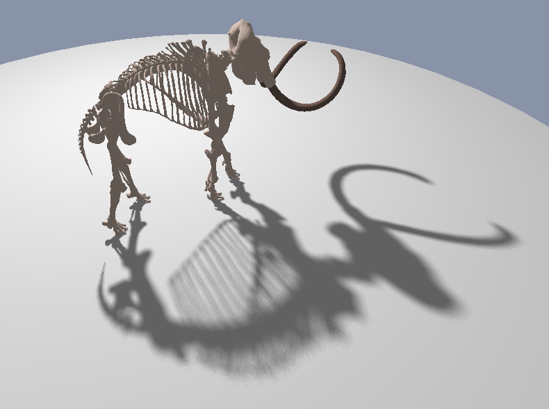

Implementation of Percentage Closer Filtering (PCF) and Percentage-Closer Soft Shadows (PCSS) in OpenGL. Features a small ImGui configuration panel for adjusting various parameters at runtime. The first prototype was written as part of a school project, but has since been heavily modified and refactored.

#### Helpful resources

These explanations and code snippets were particularly useful to me when first learning about soft shadow rendering. You may find them helpful as well.

1. [https://developer.download.nvidia.com/whitepapers/2008/PCSS_Integration.pdf](https://developer.download.nvidia.com/whitepapers/2008/PCSS_Integration.pdf)
2. [https://developer.download.nvidia.com/SDK/10.5/direct3d/samples.html](https://developer.download.nvidia.com/SDK/10.5/direct3d/samples.html)
3. Tomas Akenine-Möller, Eric Haines and Naty Hoffman (2018). Real-Time Rendering (4th ed.). CRC Press. pp. 247-252.

